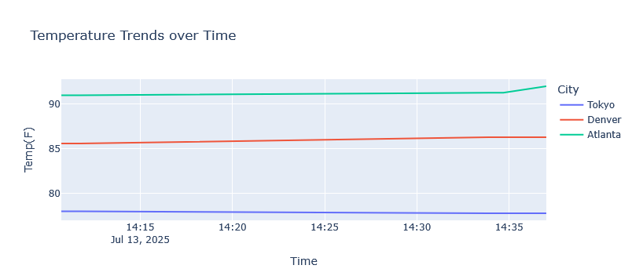

# Automated Weather Tracker

This project collects real-time weather data from the OpenWeatherMap API for multiple cities, stores it in a CSV file, and visualizes temperature trends over time using interactive Plotly graphs in a Jupyter Notebook.

## Features
- Fetches hourly weather data (temperature, humidity, wind speed, etc.)
- Automatically timestamps each data entry
- Appends to a local CSV file for persistent storage
- Interactive Plotly line graph by city and timestamp
- Runs automatically using Windows Task Scheduler

## Tech Stack
- Python
- pandas
- plotly
- requests
- Jupyter Notebook
- Windows Task Scheduler

## Visualization Example

## How to Run
1. Clone the repository or download the files.
2. Run `weather_logger.py` to collect data.
3. Open `weather_visualization.ipynb` to view the interactive chart.
4. Set up a scheduled task to run the script hourly or at login.

## File Structure
weather_project/
├── weather_logger.py
├── weather_data.csv
├── weather_visualization.ipynb
├── requirements.txt
└── README.md

## Future Improvements
- Store data in SQLite or PostgreSQL instead of CSV
- Add dashboard with Streamlit
- Add filters by date or weather condition

## Author
Mackenzie – Data Engineer in Progress™
